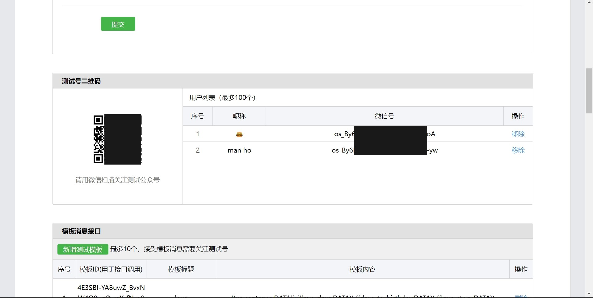

# 微信公众号推送天气给女朋友
利用程序推送天气给女朋友，来自我们程序猿满满的爱

## 功能介绍
- 推送天气
- 推送在一起多久了
- 推送给女朋友的每日一句
- 女朋友的生日倒数
- 给女朋友的生日祝福（当天）
- 情人节祝福 （未来将添加）

## 安装
1.1 克隆本仓库
```bash
$git clone https://github.com/manho30/wechat-push-weather.git
```
2.1 安装依赖
```bash
$pip install -r requirements.txt
```

### 填写配置

本教程使用测试号进行演示。

3.1 访问[微信公众测试号](https://mp.weixin.qq.com/debug/cgi-bin/sandboxinfo?action=showinfo&t=sandbox/index)

3.2 登录

3.3 复制`appID`和`appSecret` 到代码中替换


3.4 点击`青色按钮`创建模板消息


3.5 将下面的代码复制到模板内容里
```text
{{ur_sentence.DATA}} 

{{weather.DATA}} 

{{love_days.DATA}} 
{{days_to_birthday.DATA}} 

{{love_story.DATA}}
```
3.6 填写好标题后点击`提交`

3.7 将模板id复制到代码里
```python
templete_id = ''
```

3.8 然后让你女朋友扫描二维码，获取她的微信号,然后复制到代码里

```python
# ur girls openid
touser = '';
```

3.9 运行
```
$cd wechat-push-weather
$python main.py
```

### 部署到服务器
你可以将本代码部署到服务器上，以便可以进行定时发送。

4.1 输入以下终端命令
```bash
$cd wechat-push-weather
```

4.2 登录Heroku

4.3 在Heroku上创建一个新的应用

4.4 根据以下命令进行操作

```bash
$git init
$heroku git:remote -a <你的项目名字>
$git add .
$git commit -am "make it better"
$git push heroku master
```

4.5 访问以下API地址
```http
GET https://你的项目名字.herokuapp.com/
```
成功将返回以下内容
```json
{
    "msg": "send template message success",
    "ok": true
}
```
### 定时发送消息
你可以设置一个CRON job，每天早上8点发送一条消息。这里不做过多演示，可以自己去搜索。
```crontab
0 8 * * * 
```


如果你觉得本项目对你有帮助的话，清star一下，谢谢！